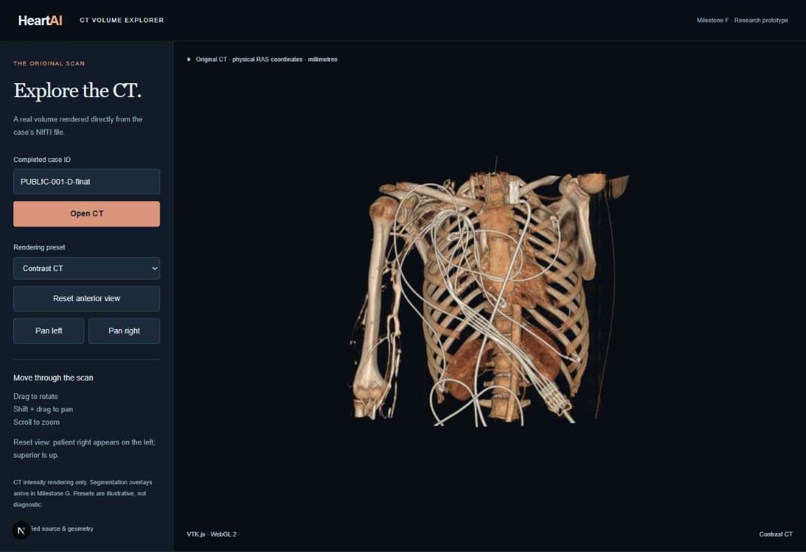
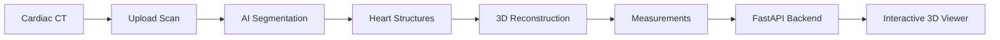

# HeartAI

### Turning cardiac CT scans into interactive 3D models

I was born with a congenital heart defect, so this project is personal to me. **HeartAI is my contribution toward building better tools for understanding and detecting heart problems.**

HeartAI takes a cardiac CT scan and uses AI to identify anatomical structures, reconstruct them in 3D, and calculate measurements from the scan.

### What it does

- 🫀 Identifies heart and blood vessel structures from CT scans
- 🧠 Uses **TotalSegmentator** for AI-powered segmentation
- 🧊 Reconstructs anatomy as interactive **3D models**
- 📏 Calculates measurements such as volume and surface area
- 🌐 Lets you explore the original CT and reconstructed anatomy in the browser
- 📦 Exports models as **GLB and STL** files
- ⚡ Provides a **FastAPI backend** for processing and retrieving scans

> **Research prototype. Not for clinical use.**

---

## Demo


HeartAI can display the original CT together with reconstructed cardiac structures directly in the browser.



The original CT can also be explored as an interactive 3D volume.


Exported models were independently opened in **3D Slicer** to verify that they remained aligned with the original CT scan.

| Reconstructed anatomy | Segmentation over CT |
| --- | --- |
|  |  |

---

## How it works



1. **Upload a CT scan**
2. **TotalSegmentator identifies anatomical structures**
3. Heart-related structures are selected from the prediction
4. The masks are converted into **3D surfaces**
5. Heart measurements are calculated
6. The results are displayed through the API and interactive viewer

---

## Current Results

The demo uses a public **512 × 512 × 321 cardiac CT scan**.

HeartAI currently produces:

- **117 segmentation masks**, with 88 structures detected in the demo scan
- **6 reconstructed cardiac structures**
- Individual **GLB and STL** 3D models
- A combined interactive heart model
- CT segmentation overlays
- Physical measurements from the predicted anatomy

The reconstructed structures currently include:

**Heart · Aorta · Pulmonary veins · Left atrial appendage · Superior vena cava · Inferior vena cava**

The demo heart segmentation measures approximately **495 mL**.

These measurements describe the model's prediction and are **not medical diagnoses**.

---

## Tech Stack

**AI / Medical Imaging**
- Python
- PyTorch
- TotalSegmentator
- MONAI
- NumPy
- SciPy
- Nibabel

**3D Processing**
- scikit-image
- trimesh
- VTK.js
- 3D Slicer

**Backend**
- FastAPI
- Pydantic

**Frontend**
- React
- Next.js
- VTK.js
- WebGL

---

## Run Locally

### 1. Clone the project

```bash
git clone https://github.com/ahmadsobohhh/HeartAI.git
cd HeartAI
```

### 2. Create the Python environment

Tested with **Python 3.12**.

```powershell
py -3.12 -m venv .venv
.\.venv\Scripts\python.exe -m pip install -r requirements-lock.txt
.\.venv\Scripts\python.exe -m pip install -e ".[test]"
.\.venv\Scripts\python.exe scripts/download_assets.py
```

### 3. Install TotalSegmentator

```powershell
py -3.12 -m venv .venv-totalseg
.\.venv-totalseg\Scripts\python.exe -m pip install -r requirements-totalseg-lock.txt
```

### 4. Analyze the demo CT

```powershell
.\.venv\Scripts\python.exe scripts/analyze_case.py data/demo/CTA-cardio.nii.gz
```

This generates the segmentations, 3D models, measurements, and previews.

---

## Run the Backend

```powershell
$env:HEARTAI_ENGINE = 'totalseg'
$env:HEARTAI_DEVICE = 'cpu'

.\.venv\Scripts\python.exe -m uvicorn backend.app.main:app --host 127.0.0.1 --port 8000
```

Open:

```text
http://127.0.0.1:8000/docs
```

for the FastAPI interface.

---

## Run the 3D Viewer

```bash
cd frontend
npm ci
npm run dev
```

Open:

```text
http://127.0.0.1:3000/volume
```

Enter a completed case ID and select **Open CT**.

You can:

- Rotate and zoom through the CT
- Switch between the CT and segmentation
- Show or hide individual heart structures
- Change model opacity
- Explore reconstructed anatomy in 3D

---

## Validation

HeartAI currently passes **48 automated tests** covering the imaging pipeline, 3D reconstruction, API, measurements, and file generation.

Generated models were also reopened in **3D Slicer** and compared with the original CT masks to verify that their position, scale, and orientation were preserved.

This validates the **software pipeline**, not the medical accuracy of the AI predictions.

---

## Roadmap

### Completed

- [x] Real CT segmentation
- [x] Cardiac structure extraction
- [x] 3D reconstruction
- [x] Anatomical measurements
- [x] FastAPI backend
- [x] Interactive CT volume viewer
- [x] Segmentation overlays
- [x] 3D model export

### Next

- [ ] Improved viewer controls
- [ ] Measurements directly inside the viewer
- [ ] Higher-resolution heart chamber segmentation
- [ ] Model fine-tuning
- [ ] Heart defect detection
- [ ] Easier deployment and demo experience

The long-term goal is to move beyond reconstruction and explore AI models that can help identify **structural heart abnormalities directly from medical imaging**.

---

## Project Structure

```text
HeartAI/
├── backend/              # FastAPI backend
├── frontend/             # React / Next.js 3D viewer
├── src/heartai/          # Imaging and reconstruction pipeline
├── scripts/              # Analysis and setup scripts
├── tests/                # Automated tests
├── docs/                 # Technical documentation
└── results/              # Generated cases and models
```

---

## Documentation

More detailed engineering and validation reports are available in [`docs/`](docs/).

These include the original development milestones covering:

- TotalSegmentator integration
- 3D reconstruction
- Spatial validation
- FastAPI development
- VTK.js rendering
- Segmentation overlays

---

## Attribution

HeartAI builds on several open-source medical-imaging projects:

- [TotalSegmentator](https://github.com/wasserth/TotalSegmentator) — pretrained anatomical segmentation
- [MONAI](https://github.com/Project-MONAI/MONAI) — medical imaging AI tools
- [3D Slicer](https://www.slicer.org/) — visualization and independent validation
- [VTK.js](https://kitware.github.io/vtk-js/) — browser-based medical visualization

Public CT data used in the demo comes from **3D Slicer CTACardio**.

---

## Why I Built HeartAI

I had surgery for a congenital heart defect when I was a child.

Years later, after studying software engineering and working with AI, embedded systems, and large-scale software, I wanted to use those skills on something that was personally meaningful to me.

**HeartAI started as an attempt to understand how AI sees the heart. My goal is to keep building it into something that can help us understand heart abnormalities better.**
