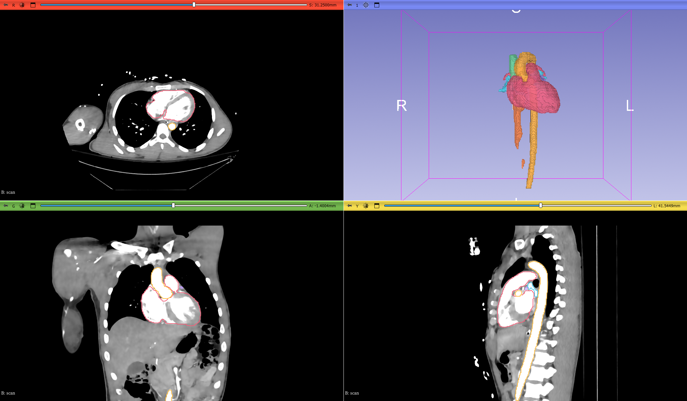
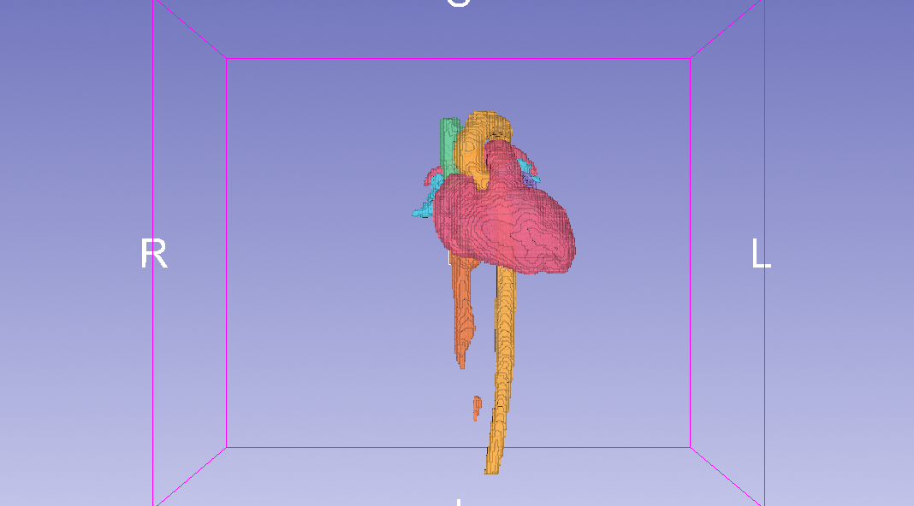
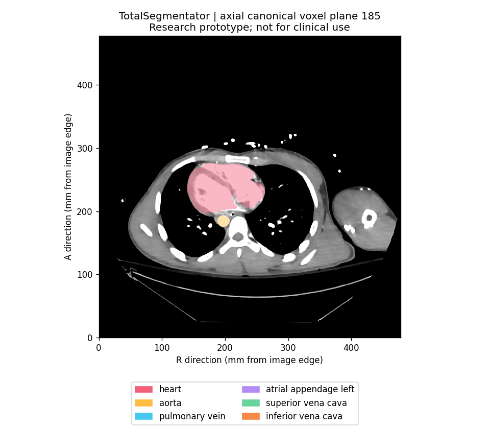
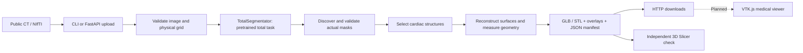

# HeartAI

### From cardiac CT to real, measurable 3D anatomy

HeartAI is a medical-imaging engineering project that turns a CT scan into anatomical masks, 3D models, and geometric measurements. It combines **pretrained TotalSegmentator inference**, a **reproducible Python pipeline**, and a **FastAPI backend**, with independent spatial checks in **3D Slicer**.

**Working today:** CT upload or CLI input → real segmentation → GLB/STL meshes → measurements → downloadable results.

**Next:** a VTK.js browser viewer for the original CT, anatomical overlays, and cutaway controls.

> Research prototype. Not for clinical use. Segmentation is powered by TotalSegmentator; HeartAI did not invent, train, or fine-tune the V1 model.

[See the results](#real-results) · [How it works](#how-it-works) · [Run locally](#run-locally) · [Engineering details](#engineering-focus) · [Roadmap](#roadmap)

## Real results



*Actual exported meshes over the public CTACardio scan in 3D Slicer. This is an independent verification session—not a screenshot of a finished HeartAI browser viewer.*

| Reconstructed anatomy | Segmentation over the source CT |
| --- | --- |
|  |  |
| Six predicted structures, exported at their original physical scale. | Generated directly from the CT and its predicted masks. |

These are real model outputs, not stock anatomy, mock segmentations, or AI-generated illustrations. Raw surface detail and disconnected components are deliberately retained. [Screenshot provenance](docs/images/README.md).

### What the demo demonstrates

The public scan contains **512 × 512 × 321 voxels**, with approximately **0.934 × 0.934 × 1.25 mm** spacing.

| Verified result | Evidence |
| --- | --- |
| 117 output masks; 88 nonempty | Full standard `total` task, TotalSegmentator 2.18.0 |
| Six cardiac structures reconstructed | Heart, aorta, pulmonary veins, left atrial appendage, superior vena cava, inferior vena cava |
| Individual GLB and STL files | Plus a combined GLB with separately named structures |
| Physical alignment preserved | All six exported STLs reproduced their source masks exactly when rasterized onto the CT grid in Slicer |
| End-to-end CLI run: 616.85 seconds | Observed CPU run, including inference, validation, geometry, and previews; not a speed guarantee |

The heart mask measures **495.029 mL** in this scan. That is a geometric measurement of a prediction, not a clinical assessment. Mesh-to-mask agreement checks the export pipeline; it does **not** establish segmentation accuracy.

The default task does not provide the coronary arteries, separate heart chambers, myocardium, or pulmonary artery used by a detailed cardiac viewer. HeartAI reports unavailable structures instead of substituting invented geometry.

## How it works



1. **Validate the input.** Check NIfTI readability, 3D shape, physical units, spatial affine, and finite CT intensities. API uploads also have byte and voxel limits.
2. **Run the pretrained model.** Execute the standard `total` task in an isolated environment and record its version, device, command, logs, and elapsed time.
3. **Inspect the actual predictions.** Read the installed label map, verify mask values and CT alignment, and select available cardiac structures.
4. **Build physical geometry.** Extract surfaces with marching cubes and apply the full image affine. Calculate voxel volumes, mesh surface areas, centroids, and bounds.
5. **Package and serve the result.** Write overlays, meshes, measurements, and a manifest with artifact paths and SHA-256 hashes. The API exposes real stages and downloads while one background worker processes scans.

### Engineering focus

HeartAI's contribution is the software around the pretrained model:

- **Spatial correctness:** preserve orientation, origin, and scale through cropping, reconstruction, and export. STL uses RAS millimeters; GLB uses right-handed Y-up meters.
- **Reproducibility:** pinned environments, checked input assets, recorded commands, artifact hashes, measured timings, and repeatable CLI/API verification.
- **Reliable execution:** bounded background jobs, upload validation, explicit failure records, overwrite protection, and downloads confined to case directories.
- **Independent verification:** reopen exported files, test coordinate round trips, and compare meshes with source masks in Slicer.
- **Honest model integration:** keep empty and unavailable labels visible in metadata; preserve the earlier MONAI proof-of-concept without mixing its labels into TotalSegmentator results.

### Technology

| Layer | Implementation |
| --- | --- |
| Segmentation | TotalSegmentator / PyTorch; pretrained `total` task |
| Image geometry | Nibabel, NumPy, SciPy; SimpleITK for demo conversion |
| Reconstruction | scikit-image marching cubes, trimesh, GLB/STL |
| Previews and measurements | Matplotlib and explicit physical-unit calculations |
| Backend | FastAPI, Pydantic, one bounded background worker |
| Verification | pytest, HTTP download checks, 3D Slicer / VTK |
| Preserved experiment | MONAI inference and its existing Next.js/React viewer |
| Planned V1 viewer | VTK.js within the React/Next.js application |

## Run locally

The tested setup is **Windows PowerShell with Python 3.12**. Run commands from the repository root. The pinned application stack supports Python 3.11–3.12. A GPU is not required; the recorded runs used CPU. Leave sufficient free memory for full-resolution inference—concurrent memory-heavy applications caused failed runs during development.

### 1. Install the application and demo assets

```powershell
py -3.12 -m venv .venv
.\.venv\Scripts\python.exe -m pip install -r requirements-lock.txt
.\.venv\Scripts\python.exe -m pip install -e ".[test]"
.\.venv\Scripts\python.exe scripts/download_assets.py
```

The asset script verifies pinned downloads and converts Slicer's public CTACardio NRRD to NIfTI without resampling. It also retrieves the preserved MONAI proof-of-concept assets. [Data provenance and checksums](docs/DATA.md).

### 2. Install the isolated segmentation environment

```powershell
py -3.12 -m venv .venv-totalseg
.\.venv-totalseg\Scripts\python.exe -m pip install -r requirements-totalseg-lock.txt
.\.venv-totalseg\Scripts\python.exe -m pip check
```

Keeping the environments separate avoids changing the working MONAI dependency stack. TotalSegmentator downloads its pretrained weights on first inference; the default project cache is `models/totalsegmentator/nnunet/results/`. Scans, weights, and generated cases are Git-ignored.

### 3. Analyze the public CT

```powershell
.\.venv\Scripts\python.exe scripts/analyze_case.py data/demo/CTA-cardio.nii.gz
```

The command creates a new case under `results/cases/`. Use `--case-id PUBLIC-001-new` for a readable ID; existing cases are never overwritten. `--totalseg-python` or `HEARTAI_TOTALSEG_PYTHON` selects a different inference environment. CPU and standard resolution are the defaults. [Full CLI options and execution evidence](docs/TOTALSEG_MILESTONE_D.md).

### 4. Run the backend

```powershell
$env:HEARTAI_ENGINE = 'totalseg'
$env:HEARTAI_DEVICE = 'cpu'
.\.venv\Scripts\python.exe -m uvicorn backend.app.main:app --host 127.0.0.1 --port 8000
```

Open [local API documentation](http://127.0.0.1:8000/docs), or upload the demo:

```powershell
curl.exe -F "file=@data/demo/CTA-cardio.nii.gz" http://127.0.0.1:8000/api/cases
```

The response returns a generated case ID. Poll its status, then retrieve the completed artifacts:

| Endpoint | Purpose |
| --- | --- |
| `GET /api/config` | Engine, task, device, and input limits |
| `GET /api/cases/{id}/status` | Actual processing stage or failure |
| `GET /api/cases/{id}/manifest` | Completed case metadata and artifact inventory |
| `GET /api/cases/{id}/volume` | Source CT |
| `GET /api/cases/{id}/segmentation/{structure}` | Individual predicted mask |
| `GET /api/cases/{id}/mesh/{structure}` | Individual GLB; add `?format=stl` for STL |
| `GET /api/cases/{id}/mesh/cardiac` | Combined cardiac GLB |
| `GET /api/cases/{id}/measurements` | Geometric measurements |
| `GET /api/cases/{id}/preview/{view}` | Axial, coronal, or sagittal overlay |

Use one server worker and bind to loopback; this prototype has no authentication. [Backend limits, errors, and real HTTP verification](docs/TOTALSEG_MILESTONE_E.md).

### Output package

```text
results/cases/<case_id>/
├── input/                 # Original CT copy
├── segmentations/         # Actual model masks
├── meshes/                # Individual GLB/STL + combined cardiac GLB
├── previews/              # CT and segmentation overlays
├── measurements.json      # Values with physical units
├── manifest.json          # Status, metadata, timings, paths, hashes
├── run.json               # Model execution evidence
└── logs.txt               # Pipeline stage log
```

To explore the current results interactively, use 3D Slicer. The [mesh-review instructions](docs/TOTALSEG_MILESTONE_D.md#independent-slicer-review) create a reopenable scene containing the source CT and exported models. **The screenshots above come from Slicer; the new browser viewer is still planned.**

## Validation

The focused suite currently passes **48 tests**. The real backend verification also downloaded **135 artifacts** and matched each one against its manifest hash. These checks establish software behavior and artifact integrity, not clinical accuracy.

Run the focused numerical, pipeline, and API tests without downloading model weights or executing full inference:

```powershell
.\.venv\Scripts\python.exe -m pytest -q tests/test_geometry.py tests/test_totalseg_reconstruction.py tests/test_pipeline.py tests/test_totalseg_pipeline.py tests/test_api.py tests/test_totalseg_api.py
```

Tests cover full affine transforms, reflected orientation, physical units, mesh export, malformed images, serialization, queue behavior, failure reporting, path confinement, and legacy compatibility. Synthetic arrays and inference mocks are limited to isolated tests.

For opt-in real HTTP verification with the server running:

```powershell
.\.venv\Scripts\python.exe scripts/verify_backend_demo.py --url http://127.0.0.1:8000
```

This uploads the public CT, follows the background job, and checks downloaded artifacts against the manifest hashes. Earlier CLI and Slicer checks are documented separately, so computational completion is not confused with anatomical or clinical validation.

## Roadmap

| Milestone | Status |
| --- | --- |
| A — Real TotalSegmentator inference | Complete |
| B — Cardiac extraction and Slicer sanity check | Complete |
| C — Physical meshes and measurements | Complete |
| D — Unified CLI pipeline | Complete |
| E — Upload, background analysis, results API | Complete |
| F — VTK.js CT volume viewer | Next |
| G — Segmentation visibility and overlays | Planned |
| H — Clipping, measurements UI, viewer polish | Planned |
| I — Release packaging and demo | Planned |

Training/fine-tuning and physics simulation are future research directions, not current features. The separately licensed `heartchambers_highres` task is not used by this baseline.

## Explore the code

| Entry point | What to look at |
| --- | --- |
| [`scripts/analyze_case.py`](scripts/analyze_case.py) | CLI and explicit engine selection |
| [`src/heartai/pipeline/totalseg.py`](src/heartai/pipeline/totalseg.py) | Stage orchestration, previews, manifest and artifact checks |
| [`scripts/run_totalseg.py`](scripts/run_totalseg.py) | Isolated model execution and run provenance |
| [`src/heartai/reconstruction/totalseg_case.py`](src/heartai/reconstruction/totalseg_case.py) | Physical reconstruction and export verification |
| [`backend/app/`](backend/app/) | Upload routes, worker queue, status and downloads |
| [`tests/`](tests/) | Numerical and service behavior checks |

Detailed evidence: [A](docs/TOTALSEG_MILESTONE_A.md) · [B](docs/TOTALSEG_MILESTONE_B.md) · [C](docs/TOTALSEG_MILESTONE_C.md) · [D](docs/TOTALSEG_MILESTONE_D.md) · [E](docs/TOTALSEG_MILESTONE_E.md).

The earlier MONAI pipeline and frontend are preserved. Use `--engine monai` for its CLI or `HEARTAI_ENGINE=monai` for its backend. Its frontend does not yet consume the TotalSegmentator case format. [Legacy setup and results](docs/LEGACY_MONAI.md).

## Limitations and attribution

The demo is one public scan, not a clinical evaluation. There are no claimed Dice scores, diagnostic conclusions, or regulatory approvals. The aorta is truncated by the scan boundary; disconnected components are retained. Raw mesh surfaces are not optimized for surgical planning or manufacturing. Runtime depends on hardware and available memory; AMD GPU acceleration has not been implemented in the tested setup.

Segmentation is powered by [TotalSegmentator](https://github.com/wasserth/TotalSegmentator). Public CTACardio data and the independent review environment come from [3D Slicer](https://www.slicer.org/). The preserved experimental path uses [MONAI](https://github.com/Project-MONAI/MONAI). See [data provenance](docs/DATA.md) and upstream projects for their respective terms and attribution requirements. No project-wide source-code license has been added yet.
