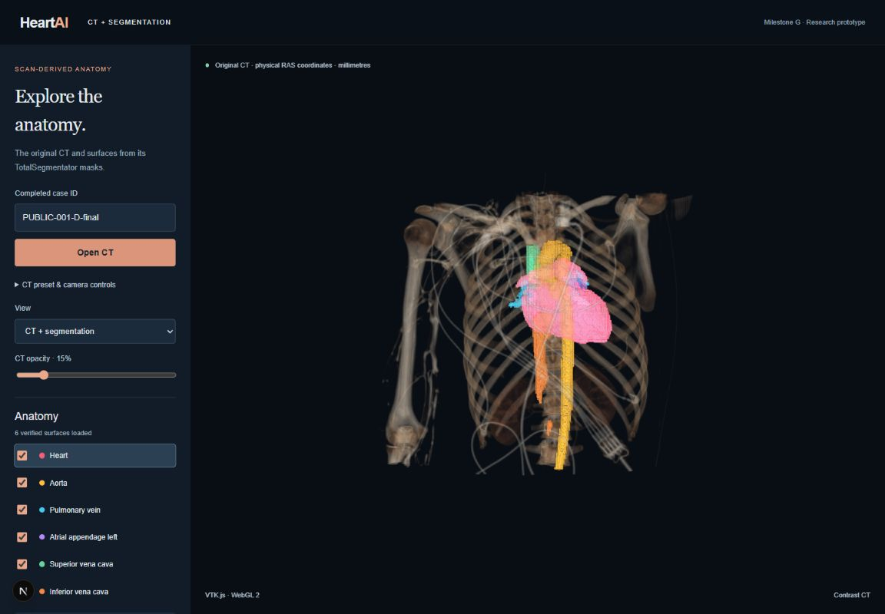

# Milestone G — Segmentation viewer

Completed 2026-09-26 on the existing public case `PUBLIC-001-D-final`. Real TotalSegmentator anatomy now overlays the original CT in the VTK.js browser viewer. No inference rerun, training, smoothing, or synthetic anatomy was used. Milestone H clipping, Cardiac Focus preset, measurement panel, and downloads remain unimplemented.



## Available anatomy and controls

The case manifest supplies six reconstructed surfaces: heart, aorta, pulmonary vein, left atrial appendage, superior vena cava, and inferior vena cava. Colors also come from the manifest. The viewer does not invent coronary arteries, separate chambers, or surfaces for all 117 model labels.

- **View:** CT only, Segmentation only, or CT + segmentation. Switching does not rerun inference or download meshes again.
- **Visibility:** each structure has its own checkbox; its preference survives mode switches.
- **Selection:** click a structure name or click a surface in the viewport. The selected row and surface lighting are highlighted. A drag rotates without selecting. CT is excluded from surface picking; hidden and zero-opacity surfaces are excluded too.
- **Opacity:** the selected structure has an independent 0–100% slider. CT has a separate opacity multiplier, initially 15% to reveal the segmentation overlay. Surface opacity starts at 85%.
- **Camera/presets:** Milestone F controls remain available under the expandable CT preset and camera controls.

If a surface fails to load or validate, the CT remains usable and an explicit error is displayed. Successfully loaded surfaces remain listed; the viewer does not substitute geometry or claim that all surfaces loaded. Reopen the case to retry. Changing cases aborts old requests and disposes actors, data, picker, listeners, and the render window.

## Coordinate and integrity checks

The API serves each existing STL through `/api/cases/{case_id}/mesh/{structure}?format=stl`. SHA-256 is checked against `artifact_sha256` before parsing. Legacy Windows separators in manifest artifact keys are normalized for lookup.

The case declares STL coordinates as **RAS millimetres**. These STL vertices already include the original CT affine; they are placed directly into the same VTK renderer as the CT. No additional affine, RAS/LPS reflection, or GLB metre/Y-up transform is applied. Binary length, finite points, triangle count, and all six bound values are checked. Unexpected STL `SPACE=` headers are rejected to prevent VTK's implicit orientation conversion.

The actual browser loader was executed against all six real files. Every triangle vertex matched the corresponding binary STL coordinate exactly. Checksums, triangle counts, and RAS bounds passed. Tests also rejected corrupted checksums, missing checksums, truncated STL files, wrong triangle counts, and displaced bounds.

An independent Slicer 5.12.4 run loaded the original CT and each STL, rasterized each surface into the CT grid, and compared every voxel centre with its source mask:

| Structure | Foreground voxel centres | Mismatches |
| --- | ---: | ---: |
| Heart | 454,365 | 0 |
| Aorta | 122,460 | 0 |
| Pulmonary vein | 18,584 | 0 |
| Left atrial appendage | 4,501 | 0 |
| Superior vena cava | 15,118 | 0 |
| Inferior vena cava | 23,403 | 0 |

The Slicer four-up and surface captures were visually inspected against the browser: same orientation, location, shape, and scan truncation. This establishes spatial/serialization fidelity, not anatomical correctness or clinical accuracy. The raw voxel-scale surface detail and disconnected components are intentionally retained.

## Verification and reproduction

Start the existing backend and frontend as described in the [README](../README.md#open-the-ct-in-your-browser), then open `/volume` and load the completed case. The verified session used frontend port 3000 and backend port 8765 (`NEXT_PUBLIC_API_URL`). AMD RX 7800 XT WebGL rendering continues from Milestone F.

From `frontend`, with the installed dependencies:

```powershell
npm run typecheck
npm run lint
npm run build
node scripts/verify-surfaces.mjs ../results/cases/PUBLIC-001-D-final/manifest.json
```

Type checking, lint, production build, and all six real-surface numerical checks passed. The standalone Node script uses TypeScript stripping (tested on Node 26.7); its module-type warning is harmless.

Browser verification exercised every structure's hide/show checkbox, name selection, and 0%/100% opacity. Heart selection by actual viewport click also passed. A 25%-opaque heart was visually inspected in segmentation-only mode. CT-only mode hid every surface; combined mode restored them. The saved source disclosure includes actual VTK visibility and opacity values, so UI labels alone were not treated as proof.

To repeat independent Slicer verification, set the following environment variables and launch Slicer with `--no-splash --ignore-slicerrc --python-script` pointing to the absolute path of [`verify_totalseg_meshes_in_slicer.py`](../scripts/verify_totalseg_meshes_in_slicer.py):

```powershell
$env:HEARTAI_MESH_CASE = (Resolve-Path results/cases/PUBLIC-001-D-final).Path
$env:HEARTAI_MESH_RECONSTRUCTION_REPORT = 'reconstruction/reconstruction.json'
$env:HEARTAI_MESH_REVIEW_FOLDER = 'milestone-g-slicer-new'
```

Choose a fresh output folder each time; the script does not overwrite an existing review.

## Evidence and implementation

- [`VolumeViewer.tsx`](../frontend/components/VolumeViewer.tsx): combined scene, controls, picker, cleanup.
- [`segmentation-surfaces.ts`](../frontend/lib/segmentation-surfaces.ts): shared binary surface and integrity validation.
- [`verify-surfaces.mjs`](../frontend/scripts/verify-surfaces.mjs): real-artifact coordinate and rejection checks.
- `results/milestone-g-surfaces.json`: all six file hashes, bounds, and triangle counts.
- `results/milestone-g-browser.json`: actual per-structure interaction states and mode checks.
- `results/milestone-g-opacity-browser.png`: segmentation-only transparency capture.
- `results/cases/PUBLIC-001-D-final/milestone-g-slicer/`: new independent rasterization report, 18 CT-plane captures, four-up image, 3D image, and reopenable scene.
- `results/milestone-g-completion.json`: completion and verification summary.

Large results remain Git-ignored; the README screenshot is committed-ready under `docs/images/`. MONAI remains preserved. The existing six meshes are reused without altering their files.

VTK references: [STLReader](https://kitware.github.io/vtk-js/api/IO_Geometry_STLReader.html), [CellPicker](https://kitware.github.io/vtk-js/api/Rendering_Core_CellPicker.html).
